# Thaumetopoea_Pityocampa_Dataset
 Synthetic data generator for Thaumetopoea Pityocampa nests

See the project writeup on [LinkedIn](https://www.linkedin.com/feed/update/urn:li:activity:7449497057247272962/) or check my profile.


### 1. Generate synthetic data

``` bash
<isaac_sim_path>/python.sh ./main.py \
  --camera_mode random \
  --writer_type basic_seg \
  --num_frames 500 \
  --headless \
  --data_dir <output_dir>/raw_01
```

### 2. (optional) Post-process for training a YOLO model

The scripts below live under `tool/`, which is not part of this repo. It was project-specific glue code, kept out on purpose. Adapt them yourself, or write your own, to fit your target format.

``` bash
conda activate <your_yolo_env>

# Filter out unreliable bounding boxes using the semantic segmentation mask
python tool/filter_boxes_by_semantic.py \
  --dataset-dir <output_dir>/raw_01 \
  --output-dir <output_dir>/filtered_01 \
  --min-bbox-w 7 \
  --min-bbox-h 7 \
  --min-bbox-area 70 \
  --min-visible-pixels 40 \
  --min-visible-ratio 0.30 \
  --keep-empty-frames-ratio 0.15

# Convert the Replicator output to YOLO format
python tool/replicator_to_yolo.py \
  --input-dir <output_dir>/filtered_01 \
  --output-dir <output_dir>/synthetic_yolo_01 \
  --class-name nest \
  --write-dataset-yaml
```

``` bash
yolo detect train \
  model=yolov8s.pt \
  data=<dataset_dir>/dataset.yaml \
  imgsz=1280 \
  epochs=60 \
  batch=16 \
  optimizer=AdamW \
  lr0=0.001 \
  lrf=0.01 \
  weight_decay=0.0005 \
  warmup_epochs=3 \
  cos_lr=True \
  mosaic=0.3 \
  mixup=0.0 \
  copy_paste=0.0 \
  close_mosaic=10 \
  hsv_h=0.01 \
  hsv_s=0.35 \
  hsv_v=0.25 \
  fliplr=0.5 \
  flipud=0.0 \
  degrees=3.0 \
  translate=0.05 \
  scale=0.2 \
  shear=0.0 \
  patience=15 \
  workers=8 \
  device=0 \
  pretrained=True \
  project=<dataset_dir>/runs \
  name=baseline_yolov8s
```

``` bash
yolo detect val \
  model=<dataset_dir>/runs/baseline_yolov8s/weights/best.pt \
  data=<dataset_dir>/dataset.yaml \
  split=val \
  imgsz=1280 \
  batch=16 \
  device=0 \
  project=<dataset_dir>/runs \
  name=val_baseline_yolov8s

yolo detect val \
  model=<dataset_dir>/runs/baseline_yolov8s/weights/best.pt \
  data=<dataset_dir>/dataset.yaml \
  split=test \
  imgsz=1280 \
  batch=16 \
  device=0 \
  project=<dataset_dir>/runs \
  name=test_baseline_yolov8s
```

Two more `tool/` scripts were used but take no CLI flags: they have their config (paths, class names) hardcoded at the top of the file instead.

- `tool/label_studio_export_from_json_to_yolo.py`: converts a Label Studio export into YOLO format.
- `tool/compare_gt_vs_pred.py`: runs a trained model against a labeled test set and renders ground-truth vs. prediction comparisons.

## Results

Each comparison shows Original vs Ground Truth vs Prediction.

**Comparison 01, 02, 05**

The model detects the target correctly.

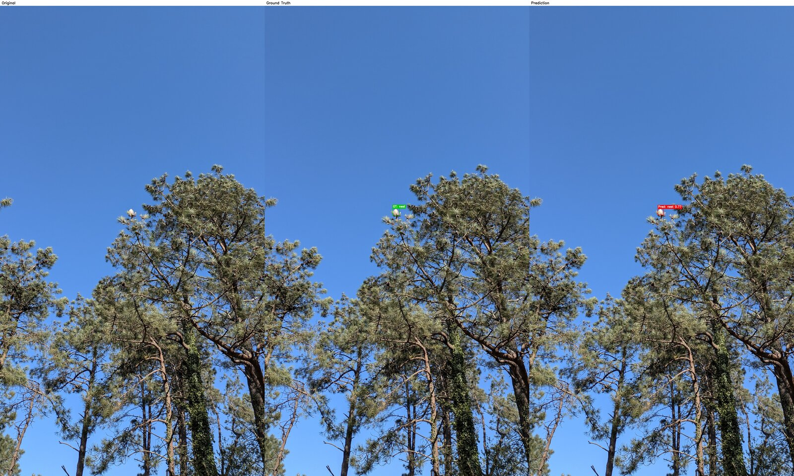
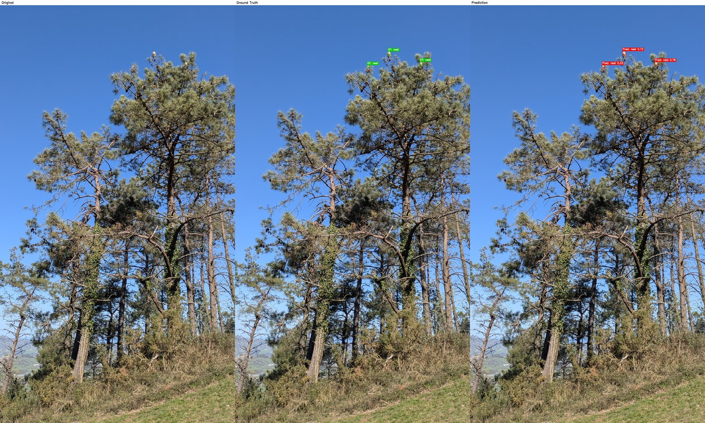
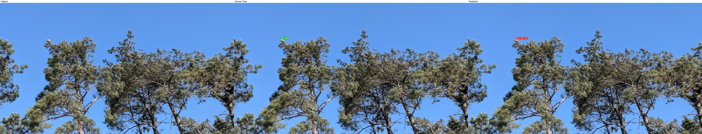

**Comparison 03**

It gets one right but misses the second, likely due to scale and occlusion within dense branches.

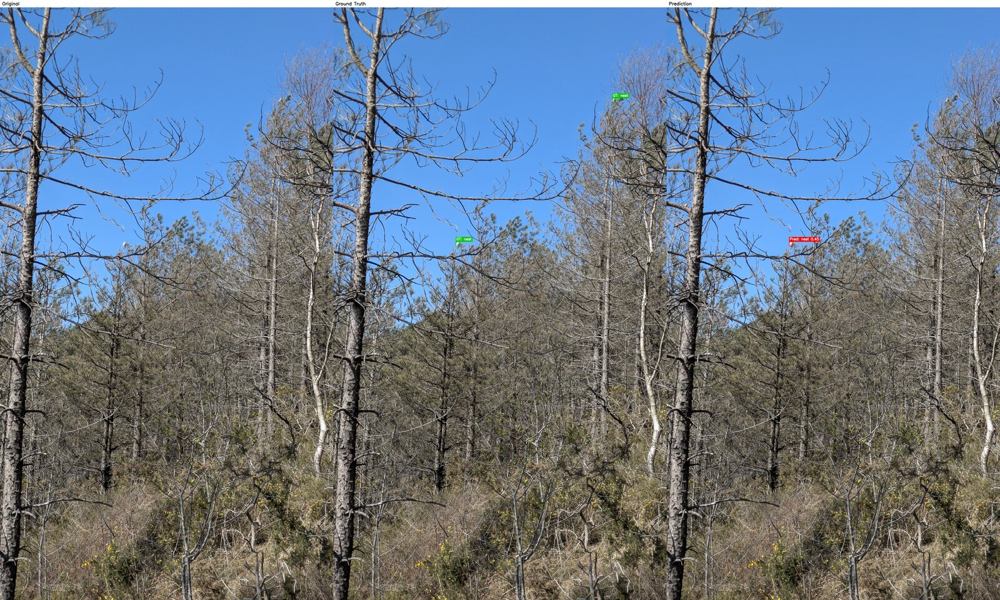

**Comparison 04 (Fog)**

Here it misses the true nest due to color similarity with the haze, and produces a false positive on a visually similar region.

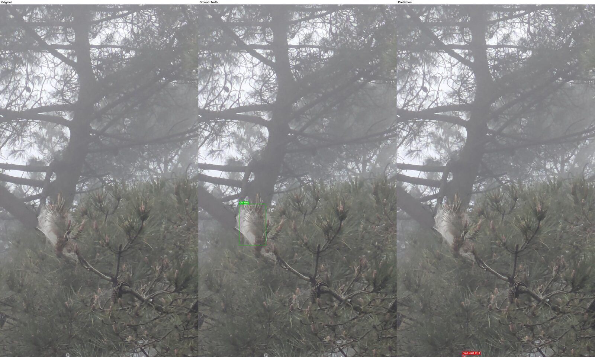

**Comparison 06**

It nails the nest again, but adds two false positives on sunlit wood fragments, likely due to strong brightness and texture similarity.

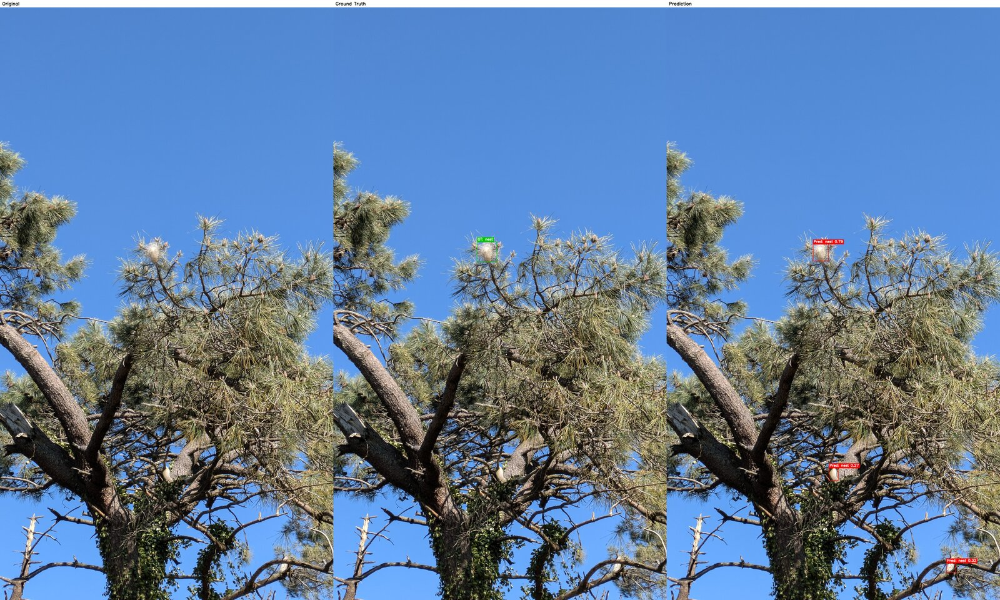

**Comparison 07 (Fog)**

One correct detection, but again a false positive slips in. With reduced color cues, the model relies more on shape, increasing confusion.

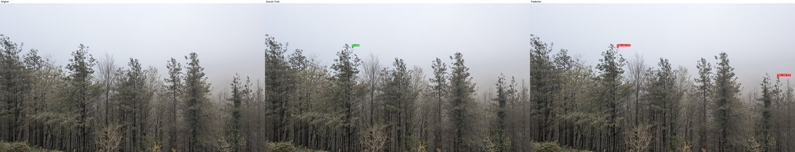

**Filtering 01, 02**

A synthetic scene generated in Isaac Sim where nests are filtered using bounding box size and mask-based visibility. Valid samples are kept in green, while small or occluded instances are discarded in red.

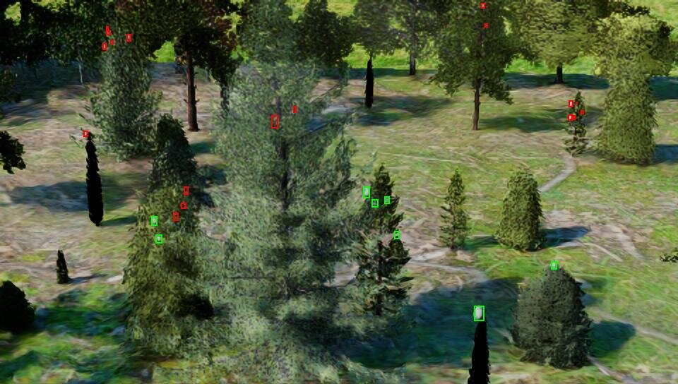
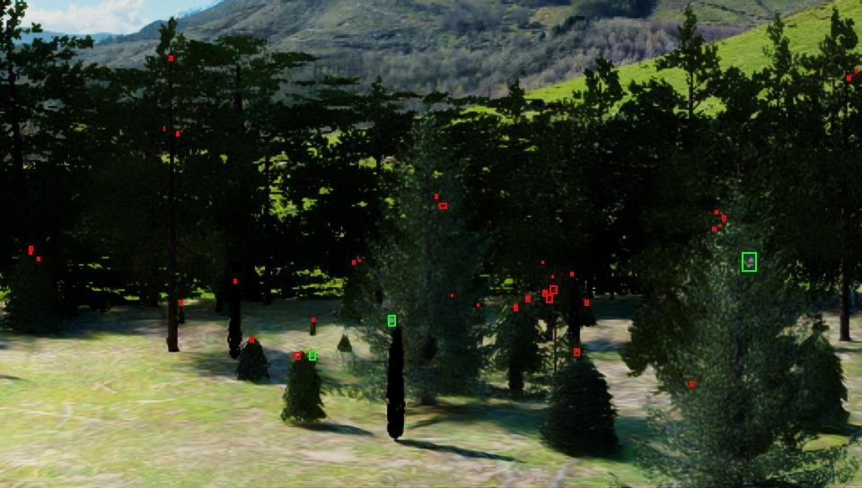

**RGB-Mask**

RGB image and corresponding segmentation mask for the same synthetic scene, with trees in green, nests in pink, and background in black. The mask is used together with bounding boxes to estimate the percentage of nest pixels inside each box and filter out occluded instances.

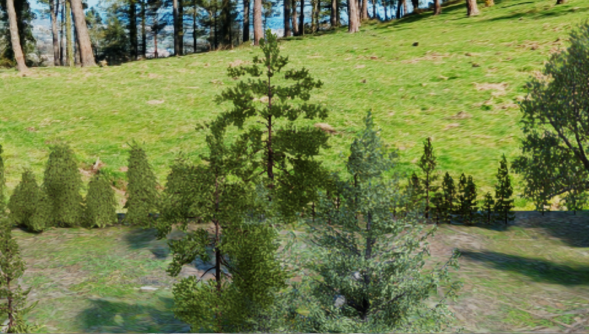
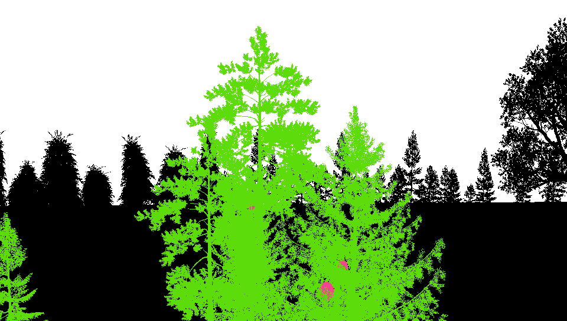

**Base Scene Before Object Randomization 01, 02**

The empty synthetic scene in Isaac Sim before adding trees and nests. This serves as the controlled baseline prior to randomization of assets and scene composition.

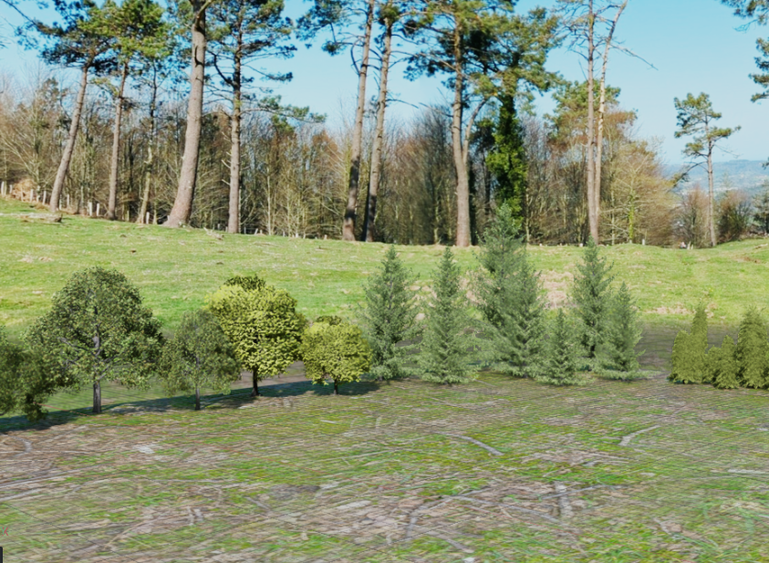
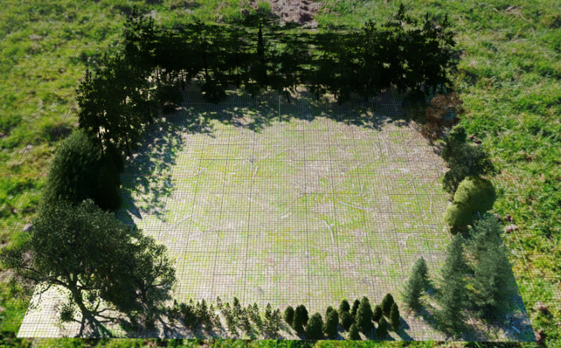
